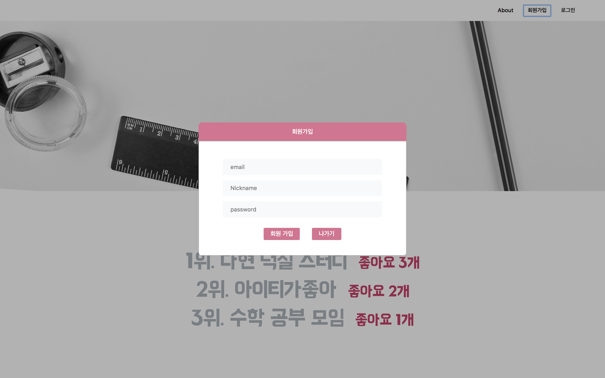
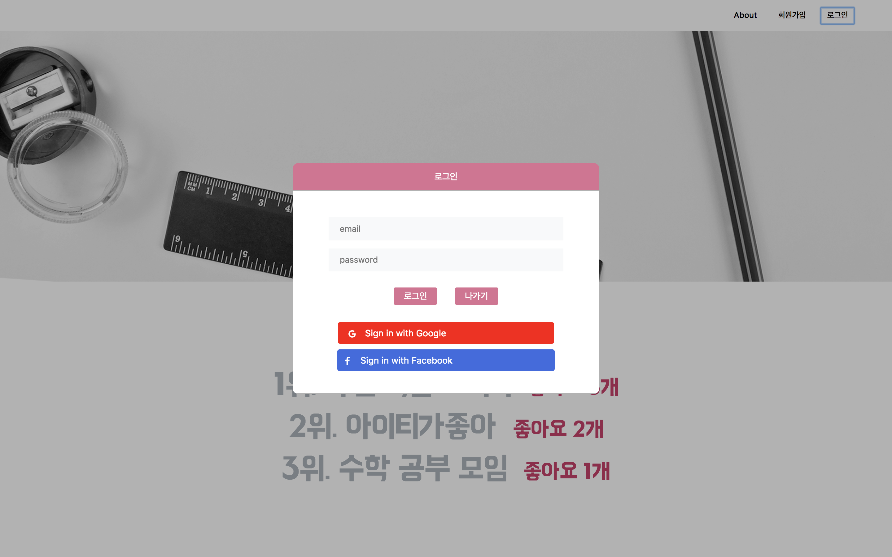
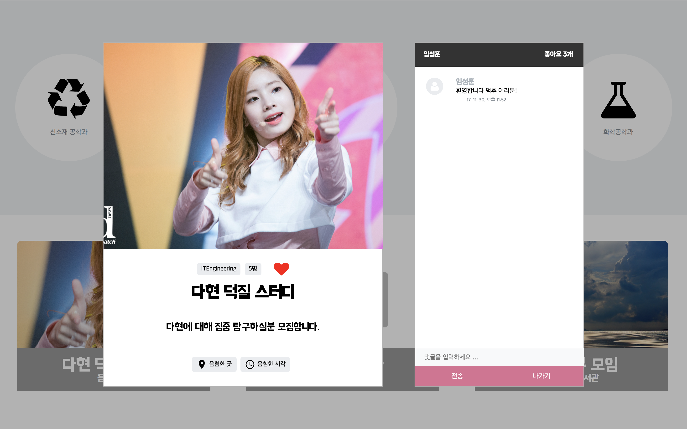
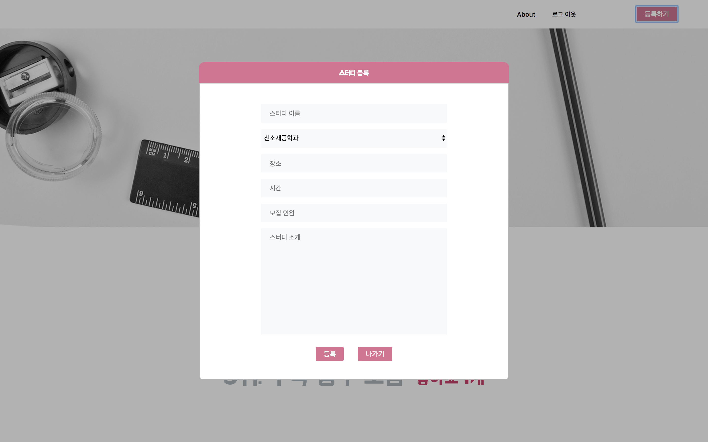
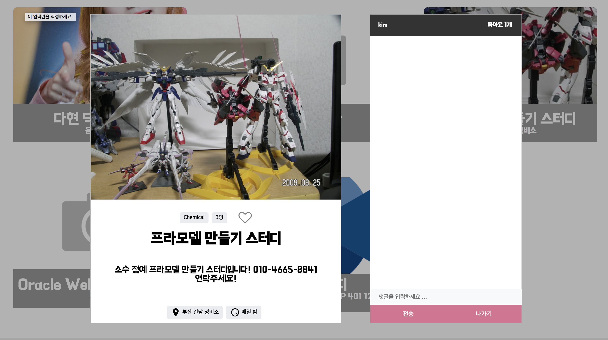
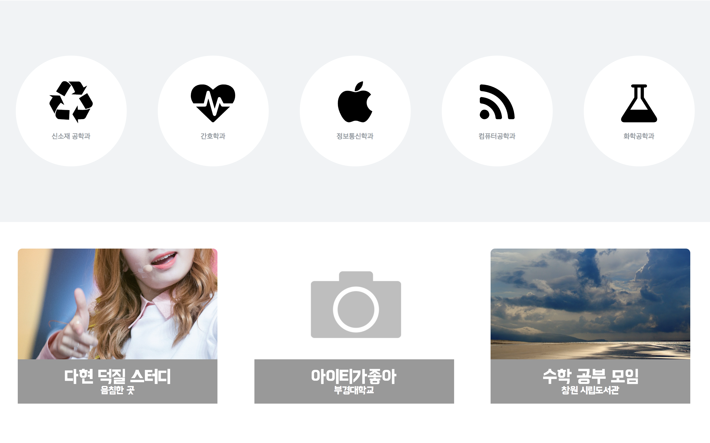
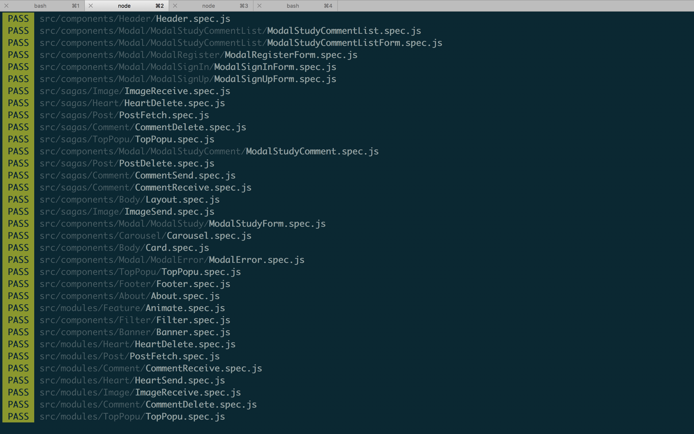
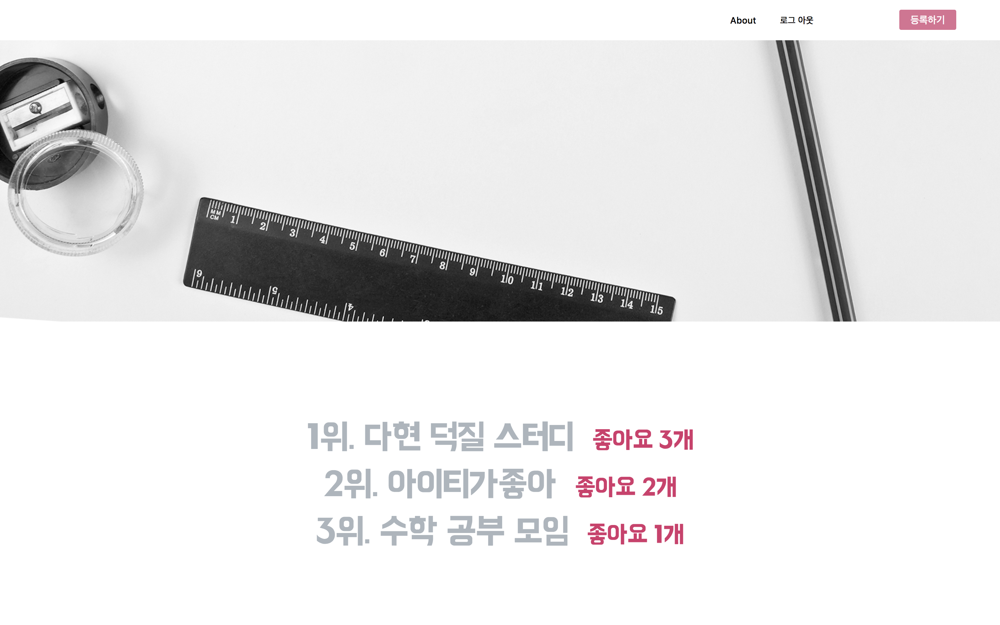

스터디 등록 플랫폼
========

>React.js/Redux  스터디 등록 플랫폼

> [https://reduxstudy-5bd05.firebaseapp.com/](https://reduxstudy-5bd05.firebaseapp.com/) 에 호스팅 되어 있습니다.

Demo
===



> 회원가입



> 로그인



> 댓글, 좋아요, 좋아요 수





> 스터디 등록



> 필터링



> 테스트 주도 개발



> 좋아요 수 인기 순위

Main Technology Stack
===
* React.js
* React-Redux
* react-router-dom
* Redux
* Redux-saga
* Redux-actions
* Redux-form
* React-redux-firebase
* Styled-Component
* open-color
* Redux Devtools

Feature
===
* 인증
* 페이스북, 구글 인증
* 글 등록, 삭제
* 좋아요 
* 댓글
* 스터디 필터링 
* 이미지 업로드
* 인기 순 정렬 
* 페이지네이션

Source Code
===
> [https://github.com/Paritta/ReduxStudy](https://github.com/Paritta/ReduxStudy)


Installation
===
1. Dowload
```
$ git clone https://github.com/Paritta/ReduxStudy
```
2. Change folder
```
$ cd Ajax-Portfolio
```
2. Set up
```
$ yarn
```
3. execute
```
$ yarn start
```

